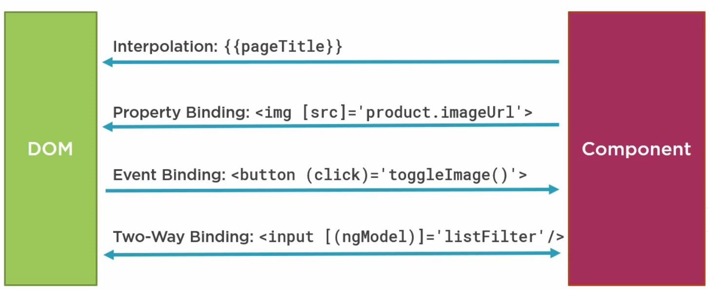

# Data Bindings

Data binding is a mechanism for coordinating what users see, with application data values. Binding types can be grouped into **3 categories**, distinguished by the direction of data flow:

* One Way \(from the data-source to view-target\)
* One Way \(from view-target to data-source\)
* Two Way \(view-to-source-to-view \)

