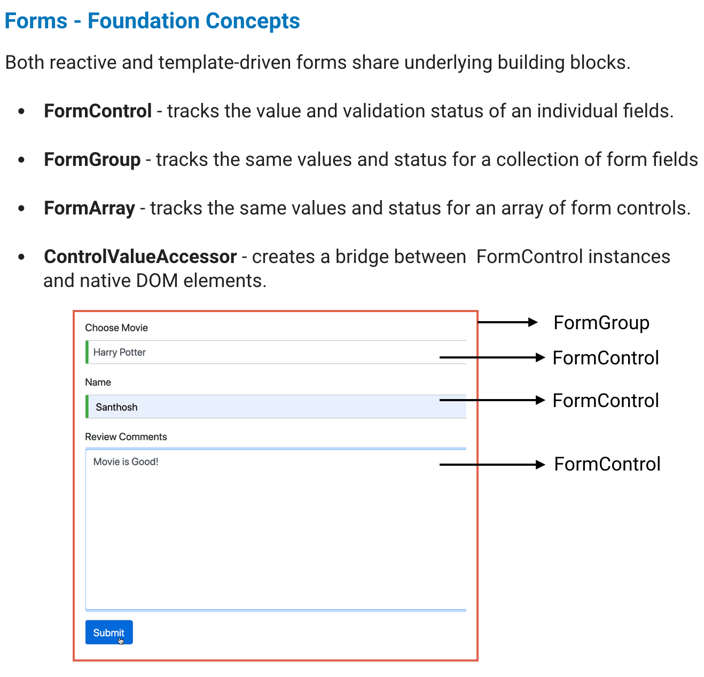

# Forms

A web **form** on a web page allows a user to enter data that is sent to a server for processing.

Applications use **forms** to enable users to 

* log in
* to update a profile
* to enter sensitive information
* to perform many other data-entry tasks.

**Angular** provide:

* Template-driven Forms
* Reactive Forms \(or\) Model-Driven Forms

