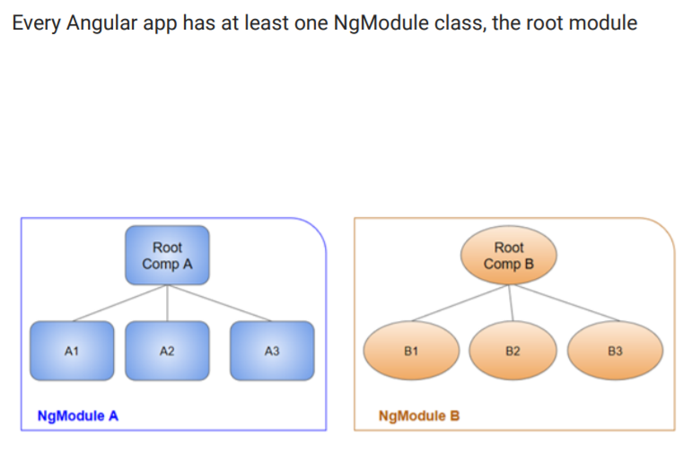

# Modules

A **module** is a reusable piece of code that encapsulates implementation details and exposes a public API so it can be easily loaded and used by other code In JavaScript ES5, we had two ways to achieve modularity,

* Immediately Invoked Function Expression \(IIFE\)
* Revealing Module Pattern

