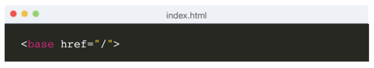
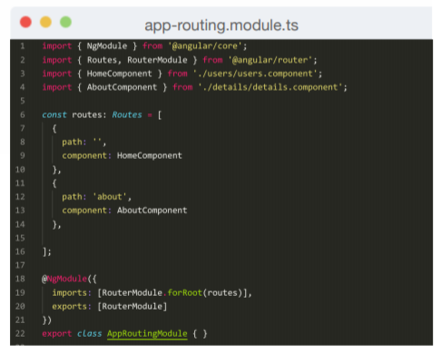
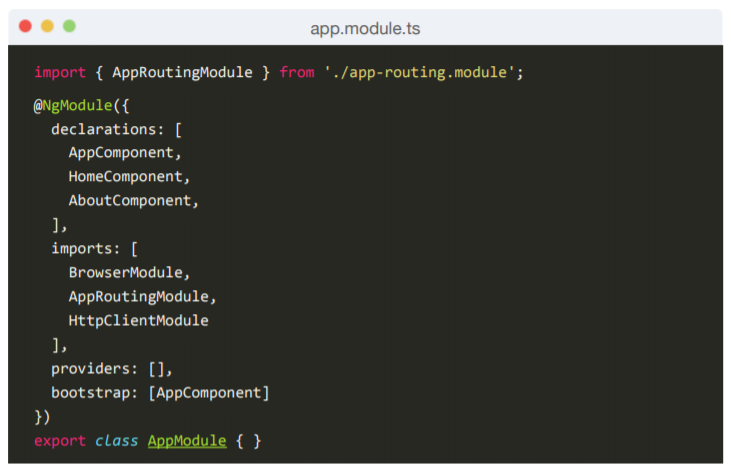
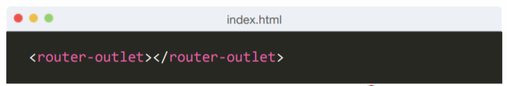

# Routing

The **Angular Router** enables navigation from one view to the next as users perform application tasks. 

**Step 1:** Add a  to **index.html** as the first child in the tag

**Step 2:** Create a **app-routing.module.ts** with routing configuration

**Step 3:** Import the routing config **AppRoutingModule** to **Main Module**

**Step 4:** add **&lt;router-outlet&gt;** to Component Markup

