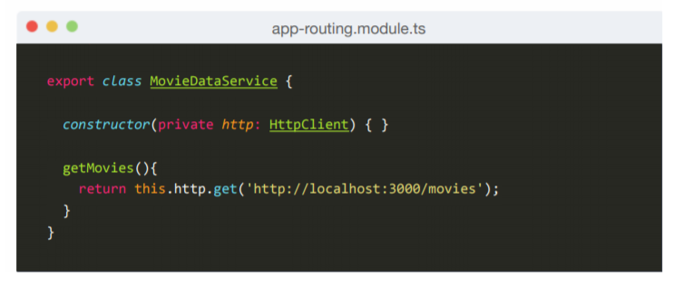

# Services

Services are a great way to share information among classes that don't know each other. A component can delegate certain tasks to services, such as fetching data from the server, validating user input, or logging directly to the console.

