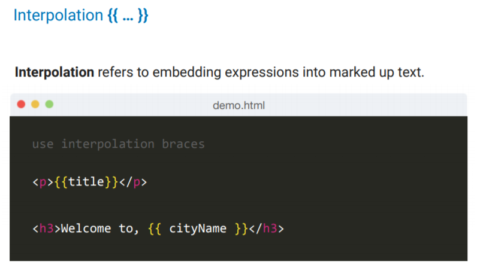
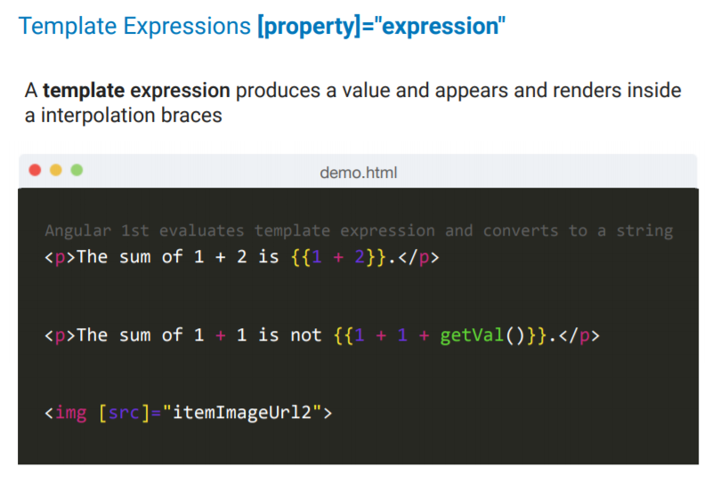
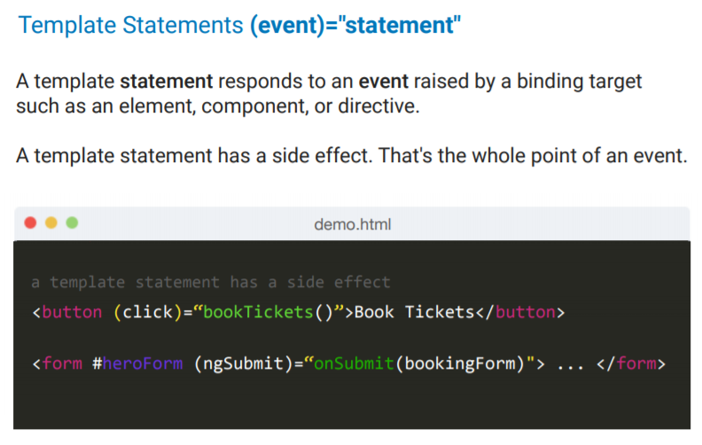

# Templates

Templates are written with HTML that contains Angular-specific elements and attributes. Angular combines the template with information from the model and controller to render the dynamic view that a user sees in the browser.

* Interpolation
* Template Expression
* Template Statements

