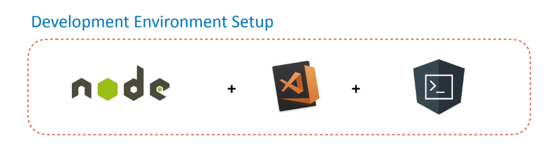

# Dev Environment Setup

### Software Requirements

* [Node JS](https://nodejs.org/en/) - Runtime which is required by Angular Dev tools
* [Visual Studio Code](https://code.visualstudio.com/) - Editor used to write angular code
* [Angular CLI](https://cli.angular.io/) - Utility to generate angular code
* [Mockoon](https://mockoon.com/) - Fake REST API Server
* [GIT](https://git-scm.com/downloads) - Version Control



