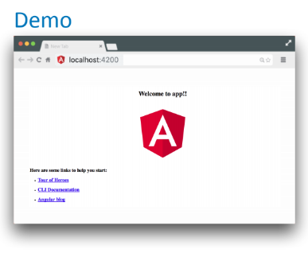

# Creating new angular Project

### Create new angular project

Open Command Prompt / Terminal and type the following commands to create a new project,  

```text
> ng new hello-world
> cd hello-world
> ng serve -o --port 4200
```



### 

