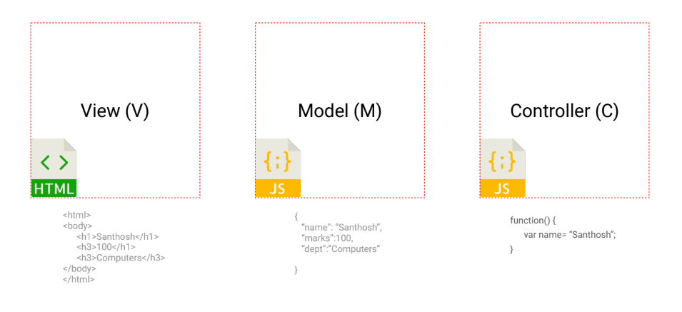
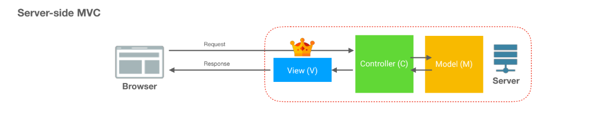
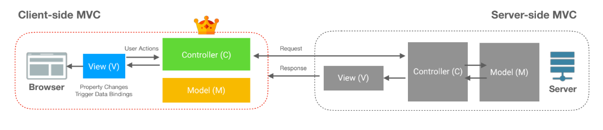
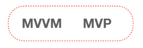

# Front-end Architecture

### Model, View, Controller

The key to understanding most of the popular front-end architecture is learning the basic vocabulary of front-end development. The three 3 terminologies which you will often encounter are:

* View \(V\) - Written in HTML. Defined the Structure of Web Page. 
* Model \(M\) - Written in JSON and JavaScript. Defines the data used in the application.
* Controller \(C\) - Written in JavaScript / TypeScript. Defines the business logic used by the application

### Server-side M-V-C

**MVC** is the most popular architecture in server-side application development. In this pattern, an app is designed using Model, View and Controller. The "Controller \(C\)" holds the business logic of the app and it receives the data from the database using "Models \(M\)" and builds the "View \(V\)" and serve the view to the client side browser.   

### M-V-C in Client-side

With JavaScript and browsers getting more powerful, developers started using MVC model for the client side development, where developer writes the "Controller \(C\) - business logic" in JavaScript file. This JavaScript Controller is served to browser via the HTML served in the first page load.

Upon the first page load, the JS controller code takes over the DOM and controls the life cycle of the presentation layer "View \(V\)". "Models \(M\)" are written in JavaScript and represented as JSON/XML and are used to handle data between controller and view layers. 

### Other Front-end Patterns

Inspired by **MVC** in client-side,  there are numerous other architectural patterns which are used in front-end engineering. 

