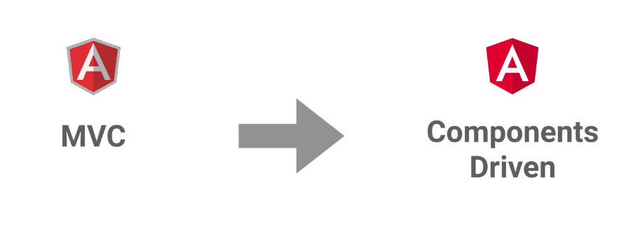
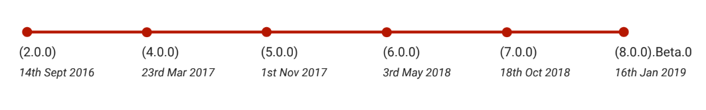
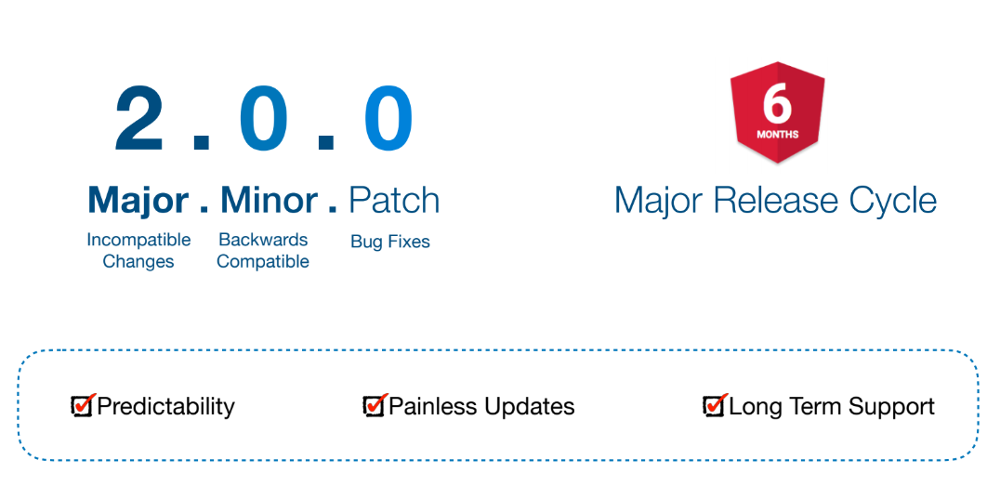
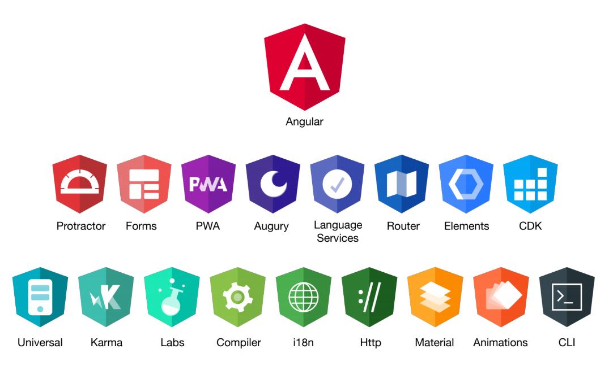

# Introducing Angular

### The Story of Component Driven Design

While Angular JS framework was advocating on MVC Architecture for front-end engineering, Facebook's React JS pioneered Component-driven design where a web page is visualized as system of components. Like native HTML component such as "&lt;select&gt;", "&lt;form&gt;", "&lt;p&gt;" and "&lt;h1&gt;", we can create our custom components like "&lt;my-header&gt;", "&lt;customer-form&gt;". 

This idea of component driven design is seen as the future of web development. World wide Web Consortium \(W3C\) has also released a new manifesto and draft proposal for supporting component driven design via their [Web Components](https://webcomponents.org) project. 

In 2016, Angular core team decided to move away from MVC architecture to Component driven. The team re-wrote the whole framework in TypeScript from ground-up. They re-named the framework from "Angular JS" to "Angular" dropping the word "JS" in the end. 

This  a new component driven framework "Angular" was born. 

## Angular

**Angular is a JavaScript framework** for building modern applications for the web, mobile, or desktop in HTML and TypeScript.

Angular is written in **TypeScript**. Angular uses **Component Architecture**.

### Angular Versioning and Release Timeline

Angular uses Semantic versioning, where it uses three-part **version** number: major **version**; minor **version**; and patch. Angular team will release major version every six month.

### Angular Ecosystem

Angular has now more sophisticated tooling, sub-projects and initiatives making it a rich platform to build scale-able, high performant user experience. 

