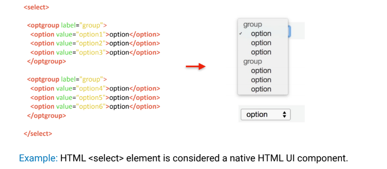
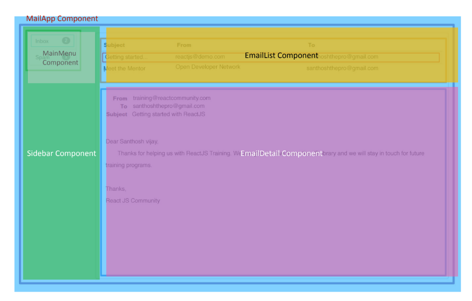

# Understanding Component Driven Design

### What is a UI Component?

An UI component is a region in a web page,

* that contains an isolated UI feature \(i.e. a view\)
* that is distinct from everything around it.

> _"We’re not designing pages, we’re designing systems of components."_ _- Stephen Hay \(Author of Responsive Design Workflow\)_

### Designing Email App as Components

Inspired from Native HTML Components, component driven libraries and framework like React JS and Angular enable developers to **break the application as individual components which can be composed together to create the application**. 

Each Component has **3 key parts**:

* Model \(M\) - which handles data from and to the component
* View \(V\) - which defines the user interface of the components
* Controller \(C\) - which defines the business logic of the components

