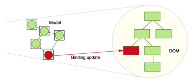

# Understanding Change Detection in Angular

Change Detection means **updating the DOM whenever data is changed**. 

#### Manual Change Detection - J-Query, Backbone

### Angular JS - Change detection using $digest

* Watch expression connects DOM to Scope
* Digest Cycle invokes every watch expression and runs update
* Change detection would run multiple times \(up to 10\) until watchers stabilized

### Angular - Change detection using Template Bindings

* Every Component has a change detector
* One pass of change detection, from top to bottom
* Much faster than Angular JS $digest cycles

#### What triggers change detection?

* Events \(click, scroll, etc.\)
* XHRs
* Timers
* Basically, any async call
* **ApplicationRef.tick\(\)** triggers change detection in root component

Angular uses **Zones** internally to trigger change detection. 

#### What is a Zone? 

A **Zone** is an execution context that persists across async tasks. You can think of it as thread-local storage for JavaScript VMs.

Angular provides **two strategies** for Change Detection:

* **Default** - Run Change Detector whenever data changes, hence updating the DOM  
* **onPush** - Angular will only run the change detector  when a new reference for data is created

