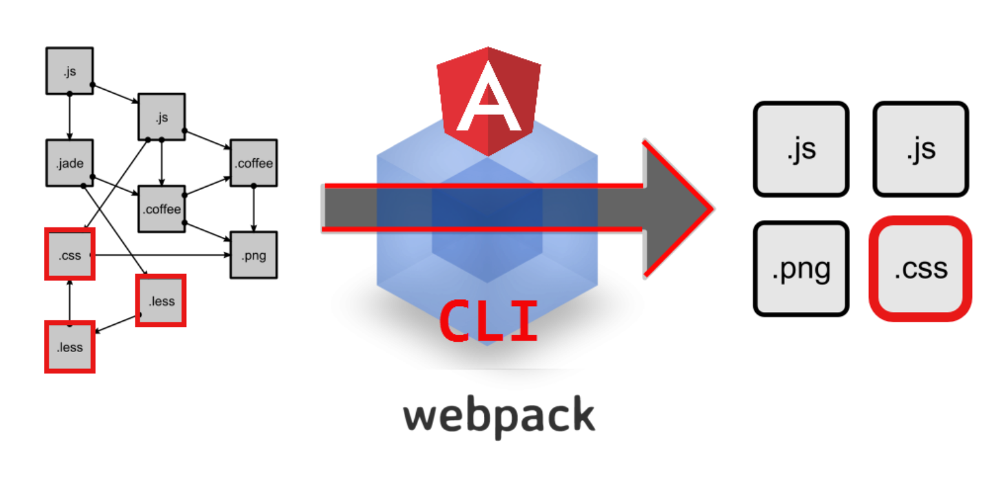
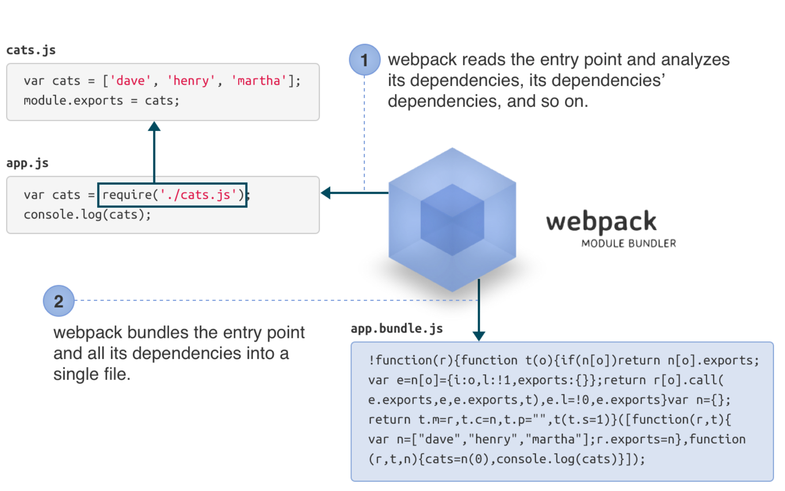
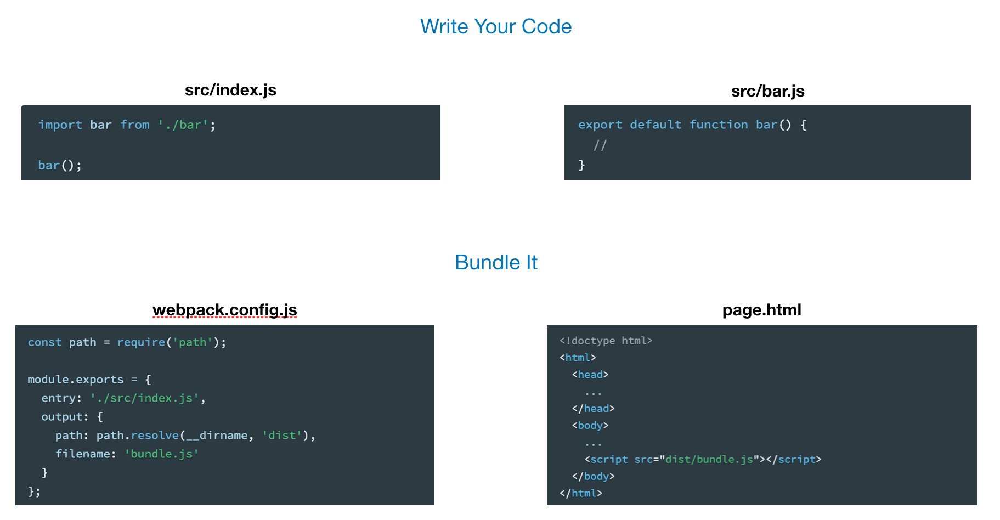

# Webpack

**Webpack** is a static **module bundler** for modern JavaScript applications. 

When webpack processes your application, it internally builds a [dependency graph](https://webpack.js.org/concepts/dependency-graph/) which maps every module your project needs and generates one or more bundles.


[https://webpack.js.org/concepts/](https://webpack.js.org/concepts/)


