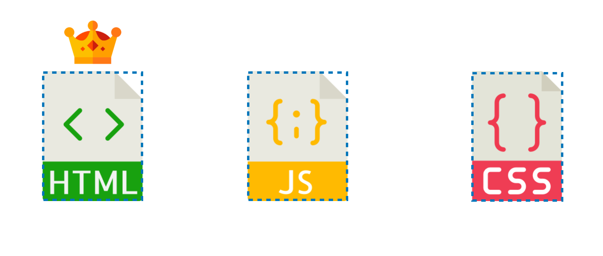
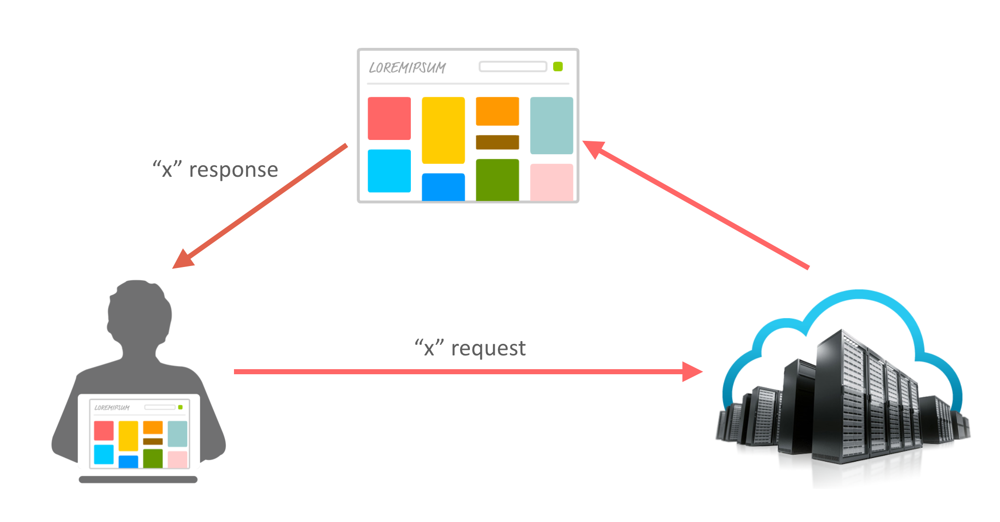
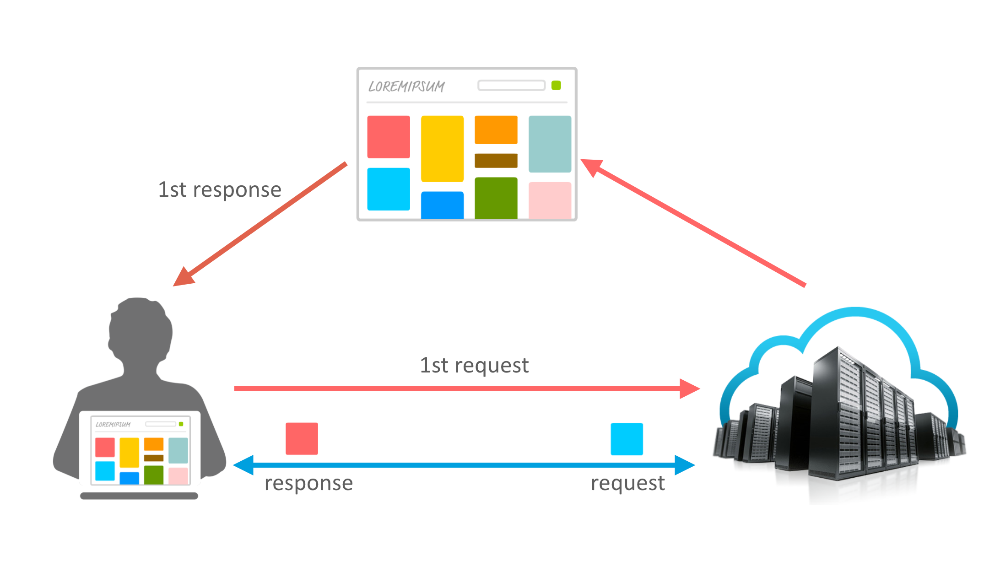
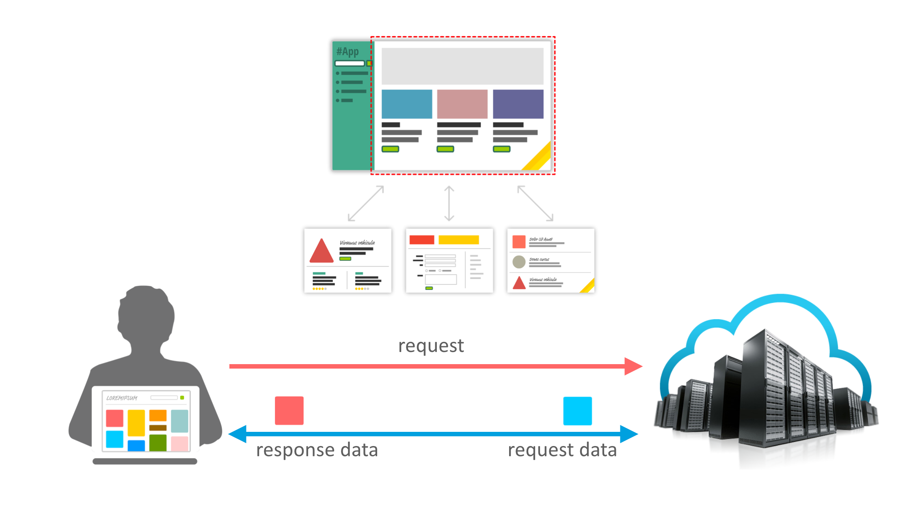
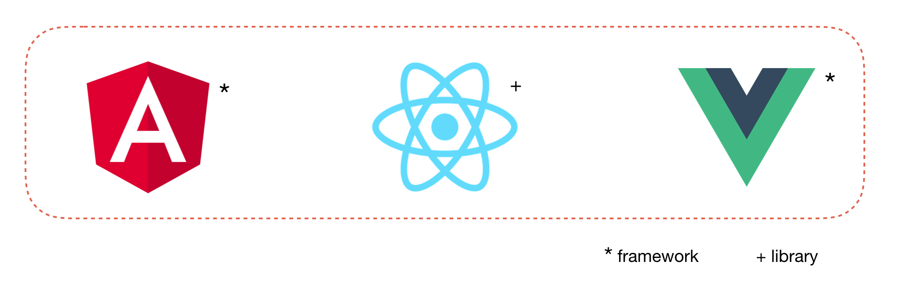

# From 1990 to Present

### Building Blocks of a Web Page

3 Basic files which constitutes a web page are,

1. **HTML** - Defines the structure of the web page. Referred as 'The DOM - Document Object Model' 
2. **JavaScript** - Defines the dynamic behavior of the web page, such as business logic, animation.
3. **CSS** - Defines the styling of the web page

### Server-side Rendering \(From 1990\)

Since the advent of Internet, web pages are served to browsers using server-side rendering. In this approach, the user request the server for every page and piece of information and server responds to the browser with necessary markup and information. Hence, Each user action required that a complete new page be loaded from the server.

The advantage of server-side rendering was browser need not do the heavy-lifting as the whole page is computed and rendered in the server and only the HTML markup is served to the browser. Whereas the major dis-advantage of server-side rendering was reduced user Experience due to Frequent Page Load

### Birth of Ajax and XMLHttpResponse \(2005\)

In Feb 18th 2005, Jesse James Garrett in an article titled Ajax: A New Approach to Web Applications introduces the "AJAX" which was based on techniques used on Google pages. AJAX introduced a new API called "XMLHttpResponse" which established communication between web browser and server where data can be exchanged. In 2006, W3C officially released the first draft specification to standardize XMLHttpResponse as a Web Standards.

With the advent of AJAX, the user sent a request to the server for the first time and subsequent requests were made to server only to fetch data. This way the web page was not completely loaded / refreshed, only parts of the page were refreshed as new data arrived via 'XMLHttpResponse'.

The advantage of using AJAX was enhanced user experience and efficient usage of network as less requests were made to load the markup.

### Single Page Application \(2009\)

Advancement of Browsers and JavaScript language gave birth of numerous powerful client-side framework. This led to the development of what we know today as "Single Page Web Applications"

Single-Page Applications \(SPA's\) are Web apps that load a single HTML page and dynamically update that page as the user interacts with the app. SPA's use AJAX and HTML 5 to create fluid and responsive Web apps, without constant page reloads.

### SPA Technologies


According to Martin Fowler,

A **library** is essentially a set of functions that you can call, these days usually organized into classes. Each call does some work and returns control to the client.

A **framework** embodies some abstract design, with more behavior built in. In order to use it you need to insert your behavior into various places in the framework either by sub-classing or by plugging in your own classes. The framework's code then calls your code at these points.


